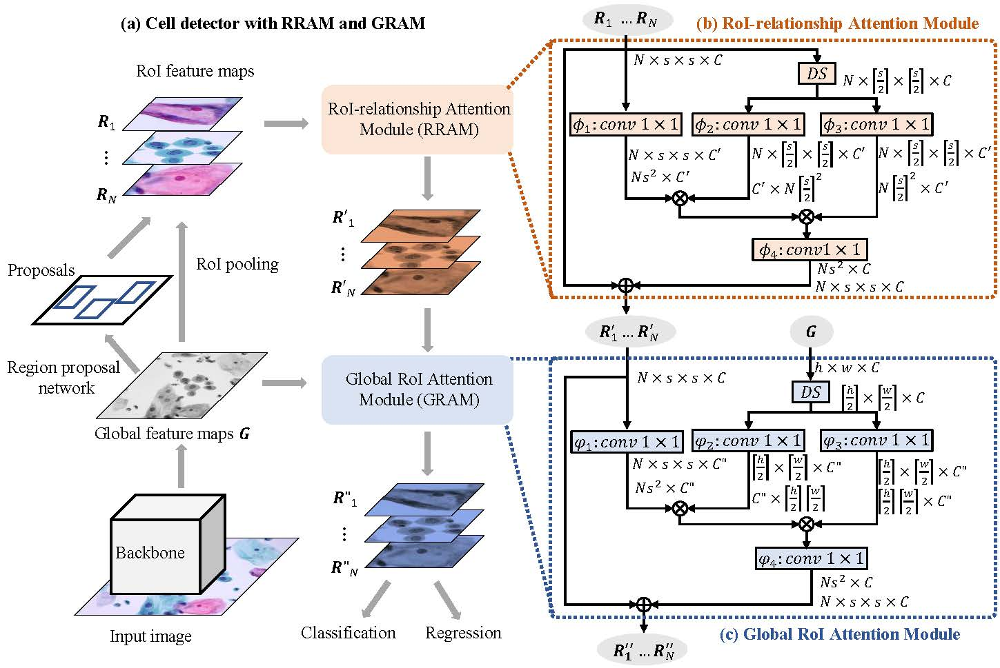

## Contextual Relationships for Cervical Cell Detection

This is the code implementation of the RoI attention method. Our code is built on the basis of MMDetection.

MMDetection is an open source object detection toolbox based on PyTorch. It is
a part of the OpenMMLab project developed by [Multimedia Laboratory, CUHK](http://mmlab.ie.cuhk.edu.hk/).

The master branch works with **PyTorch 1.6** and [**MMDetection v2.6.0**](https://github.com/open-mmlab/mmdetection).

## Datasets

We collected a liquid-based cervical cytology images dataset, called Cervical Cell Detection (CCD) dataset. The CCD dataset consists of 40,000 pathological images, 30,000 training and 10,000 testing. All annotated instances belong to 10 categories i.e., negative for intraepithelial lesion for malignancy (NILM), atypical squamous cells-undetermined significance (ASCUS), atypical squamous cells-cannot exclude HSIL (ASCH), low-grade squamous intraepithelial lesion (LSIL), high-grade squamous intraepithelial lesion (HSIL), atypical glandular cells (AGC), vaginalis trichomoniasis (VAG), monilia (MON), dysbacteriosis (DYS) and endocervical cells (EC), etc. 

## Method

The implementation of the GRAM and RRAM is in [roi_attention_head.py](mmdet/models/roi_heads/bbox_heads/roi_attention_head.py).

## Conifgs

We set up 5 config files to realize GRAM and RRAM including different combination strategies. Refer to [configs/roi_annention](configs/roi_attention) for details.

## Main Results
Train log of Cascade RRAM and GRAM is in [20220418_170256.log.json](https://drive.google.com/file/d/1EK41ipU_l5cxRWC0AY0rzh1TtVJKqMed/view?usp=sharing). The trained model is available on google driver [here](https://drive.google.com/file/d/1EK41ipU_l5cxRWC0AY0rzh1TtVJKqMed/view?usp=sharing). The trained model with multi-scale training is available on google driver [here](https://drive.google.com/file/d/1u6wWtWsSnieZorDqPrYPTUYuZUWrMh2D/view?usp=sharing).

Model | mAP | mAP@50 | mAP@75 
--- |:---:|:---:|:---:
Faster R-CNN with FPN (baseline) | 30.9 | 53.9 | 32.2
RRAM | 32.0 | 56.0 | 32.8 
GRAM | 31.9 | 56.2 | 33.1 
Cascade RRAM and GRAM | 32.4 | 56.6 | 33.5
Cascade RRAM and GRAM (multi-scale training) | 34.2 | 58.6 | 36.0 

## Contact

This repo is currently maintained by Shuo Feng ([@FengShuo96](https://github.com/FengShuo96)).
